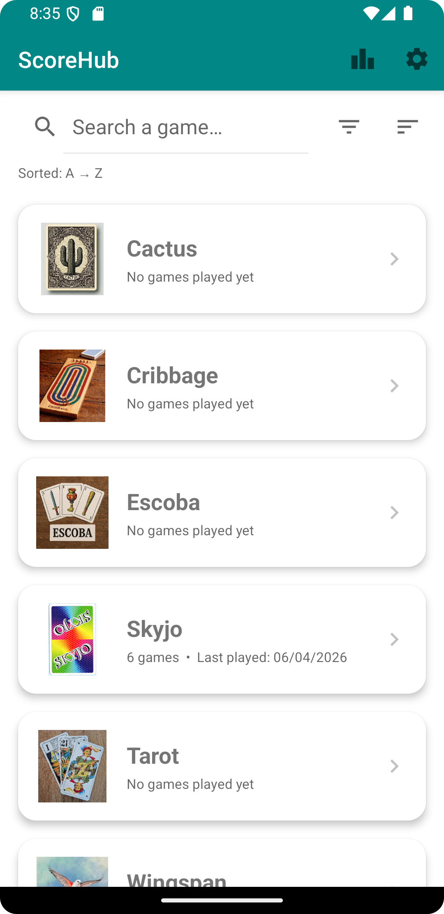
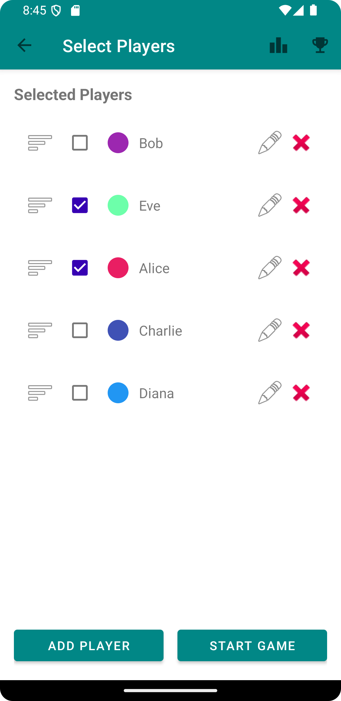
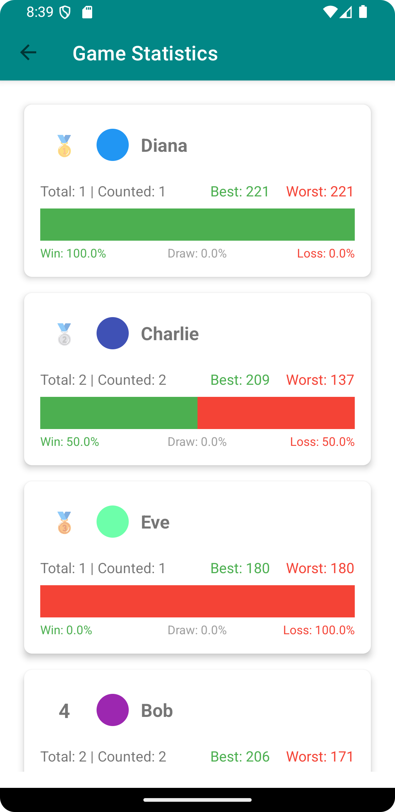
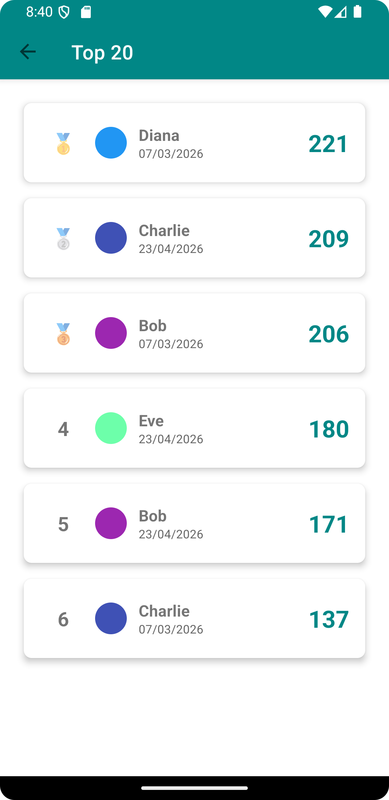
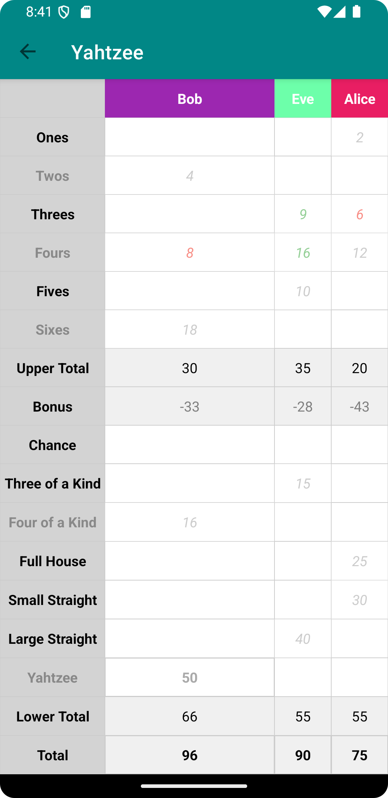
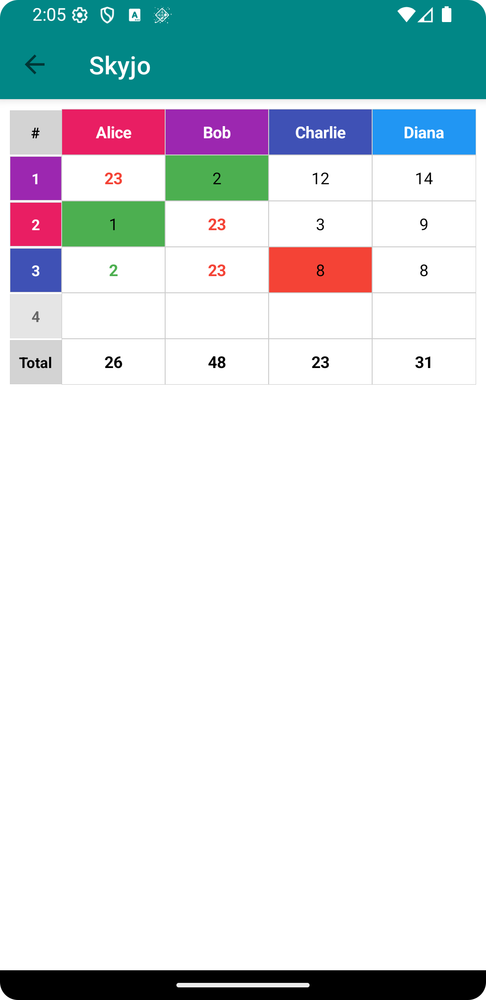
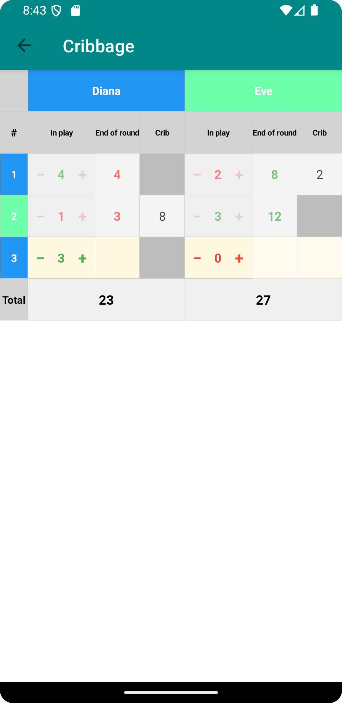

# ScoreHub

A simple and intuitive Android application for tracking game scores across multiple players.

## 🚀 Download

## 📱 Features

- **Score Tracking**: Keep detailed records of all game sessions
- **Statistics**: View comprehensive statistics including:
  - Win/loss/draw percentages
  - Best and worst scores
  - Player rankings
  - Top 20 high scores
- **Multi-language**: Supports English and French
- **Offline First**: All data stored locally using Room database

## 🎮 Supported Games

### Cactus (Cactus)
### Cribbage (Cribbage)
### Escoba (Escoba)
### Skyjo (Skyjo)
### Tarot (Tarot)
### Wingspan (Wingspan)
### Yahtzee (Yams)

## 📸 Screenshots

| =============                                                                          | =============                                                           | =============                                                                | =============                                                                    | =============                                                                     | =============                                                                     | =============                                                                     |
|--------------------------------------------------------------------------|-----------------------------------------------------------------------------|---------------------------------------------------------------------------|---------------------------------------------------------------------------|-----------------------------------------------------------------------------|---------------------------------------------------------------------------|------------------------------------------------------------------------------|
|  |  |  |  |  |  |  |

## 📋 Requirements

- Android 7.0 (API 24) or higher
- ~10 MB storage space

## 📞 Support

If you encounter any issues or have suggestions, please [open an issue](https://github.com/trivialloop/scorehub/issues).

---

Made with ❤️ for board game enthusiasts
